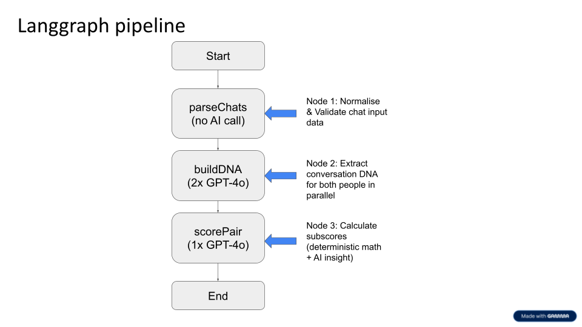
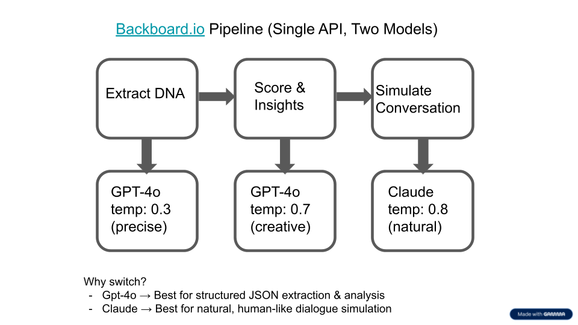

# Conversation Lab

**An AI-powered compatibility analysis platform that turns conversation history into structured communication profiles, reproducible compatibility scores, and human-readable match insights.**

**Next.js** · **React** · **TypeScript** · **Tailwind CSS** · **LangGraph** · **Backboard.io** · **GPT-4o** · **Claude Sonnet** · **Zod**

**Built at UofTHacks 13 (2026)** · [Devpost](https://devpost.com/software/conversation-lab) · [Live Demo](https://conversationlab.vercel.app)

## Project Overview

Conversation Lab explores a different approach to compatibility: instead of matching people primarily through profiles or swipes, it analyzes how they actually communicate.

Users provide conversation history, which the system converts into a structured **Conversation DNA** containing 20+ traits across six dimensions, including communication style, interaction patterns, social signals, interests, conflict handling, and emotional needs. Two profiles can then be compared to produce compatibility scores and AI-generated insights explaining where the pair aligns and where friction may emerge.

The project also includes an optional conversation simulation that generates a hypothetical exchange between two profiles as a stress test for the compatibility analysis.

### What It Does

- **Extracts Conversation DNA:** converts unstructured chat history into structured communication profiles.
- **Compares two profiles:** evaluates compatibility across multiple behavioral and conversational dimensions.
- **Combines deterministic and AI scoring:** uses reproducible mathematical scoring alongside model-generated interpretation.
- **Generates match insights:** explains strengths, potential friction points, and notable communication dynamics.
- **Simulates conversations:** optionally uses profile data to generate a realistic hypothetical interaction between two people.
- **Routes multiple models through one API:** uses Backboard.io to access OpenAI and Anthropic models through a shared integration layer.

---

## System Architecture

```text
                    ┌──────────────────────┐
                    │  Conversation Input  │
                    │     Person A + B     │
                    └──────────┬───────────┘
                               │
                               ▼
                    ┌──────────────────────┐
                    │   Parse + Validate   │
                    │   Normalize Chats    │
                    └──────────┬───────────┘
                               │
                               ▼
          ┌──────────────────────────────────────────┐
          │       Parallel Conversation DNA          │
          │                                          │
          │   Person A ──► GPT-4o   GPT-4o ◄── B     │
          │          Structured Profile Output       │
          └────────────────────┬─────────────────────┘
                               │
                               ▼
          ┌──────────────────────────────────────────┐
          │           Compatibility Engine           │
          │                                          │
          │  Deterministic Scoring + GPT-4o Insights │
          └────────────────────┬─────────────────────┘
                               │
                    ┌──────────┴───────────┐
                    │                      │
                    ▼                      ▼
          ┌──────────────────┐  ┌─────────────────────┐
          │ Match Analysis   │  │ Optional Simulation │
          │ + Explanations   │  │    Claude Sonnet    │
          └─────────┬────────┘  └──────────┬──────────┘
                    │                      │
                    └──────────┬───────────┘
                              ▼
                      ┌───────────────┐
                      │  Next.js UI   │
                      └───────────────┘
```

---

## Engineering Highlights

### Structured Conversation DNA

The analysis pipeline transforms free-form chat history into a structured profile rather than relying on unbounded model prose. GPT-4o extracts communication traits into a defined schema, allowing downstream scoring logic to operate on consistent fields instead of parsing arbitrary text.

**Zod schemas** define the expected structure and inferred TypeScript types for Conversation DNA and compatibility data.

### Hybrid Compatibility Scoring

Conversation Lab deliberately separates **measurement** from **interpretation**. Compatibility subscores are calculated with deterministic logic for reproducibility, while GPT-4o provides the human-readable reasoning and contextual insight around those scores.

This avoids making the final compatibility result entirely dependent on a model generating a different numeric answer from one run to the next.

For a deeper breakdown of the scoring approach, see [`scoring-explained.md`](./scoring-explained.md).

### LangGraph Orchestration

The main analysis workflow is orchestrated with LangGraph:

1. **Parse and validate** the submitted conversations.
2. **Build both Conversation DNA profiles in parallel** with GPT-4o.
3. **Score the pair** using deterministic calculations plus an AI-generated interpretation.
4. Return the structured result to the application.

The optional simulation runs through a **separate graph**. During development, splitting analysis and simulation into independent workflows avoided dynamic-routing issues and kept each execution path explicit.

<p align="center">
  
</p>

### Multi-Model Routing with Backboard.io

The project uses **Backboard.io as a single LLM gateway** while assigning models to the tasks they handled best during the hackathon:

- **GPT-4o at lower temperature:** structured Conversation DNA extraction.
- **GPT-4o at a higher temperature:** compatibility interpretation and match insights.
- **Claude Sonnet:** more natural, varied conversation simulation.

This made it possible to switch between OpenAI and Anthropic models without maintaining separate provider integrations throughout the application.

<p align="center">
  
</p>

### Reliability Through Structured Outputs

One of the main engineering challenges was keeping LLM output predictable enough for a multi-stage application. Early responses could contain malformed JSON or inconsistent profile structures.

The pipeline uses structured prompts, explicit data schemas, temperature tuning, and fallback handling to keep model responses consistent for downstream scoring.

---

## Technology & Responsibilities

| Technology | Role |
|---|---|
| **Next.js / React** | Web application and user-facing workflow |
| **TypeScript** | Typed application and pipeline logic |
| **Tailwind CSS** | Interface styling |
| **LangGraph** | Multi-step AI workflow orchestration |
| **Backboard.io** | Shared gateway for OpenAI and Anthropic model calls |
| **GPT-4o** | Conversation DNA extraction and compatibility insights |
| **Claude Sonnet** | Optional conversation simulation |
| **Zod** | Schema definitions for structured Conversation DNA and compatibility data |
| **Vercel** | Application deployment |

---

## Pipeline Design

The standard compatibility analysis makes **three model calls**: two GPT-4o calls to build each person's Conversation DNA in parallel, followed by one GPT-4o call for scoring insight. The mathematical portion of the compatibility score is calculated deterministically in application logic.

The optional simulation adds a Claude call using both profiles, their Conversation DNA, and the compatibility result to generate a hypothetical interaction.

This split keeps the core compatibility result reproducible while still using generative models for the parts where natural-language interpretation is most useful.

---

## Privacy & Product Considerations

Conversation Lab was designed as an **opt-in** concept: conversation data should only be analyzed with the user's explicit consent. The hackathon also prompted us to think about data deletion, model transparency, and the risks of presenting probabilistic compatibility analysis as objective truth.

The system is intended as an exploratory compatibility tool, not a definitive assessment of a person or relationship.

---

## Hackathon

Conversation Lab was built for **UofTHacks 13 in January 2026**.

The project focused on combining structured AI extraction, deterministic scoring, multi-model orchestration, and a usable web experience within a hackathon timeline.

- [View the Devpost submission](https://devpost.com/software/conversation-lab)

---

## Running Locally

```bash
npm install
npm run dev
```

Then open `http://localhost:3000`.

The AI-powered features require the appropriate API credentials to be configured as environment variables.

---

## Future Directions

- Integrate consent-based conversation imports instead of manual chat submission.
- Expand Conversation DNA with additional behavioral dimensions.
- Run multiple simulations as a consistency check against the primary compatibility analysis.
- Evaluate scoring against real outcomes rather than relying solely on predicted compatibility.
- Explore applications beyond dating, including networking and team matching.
